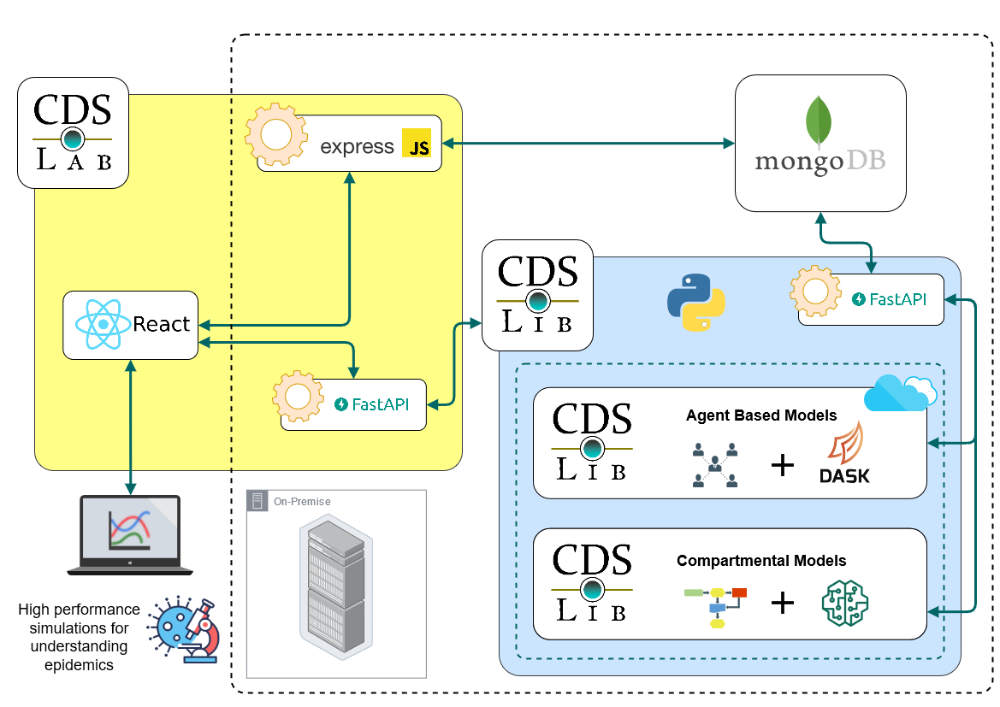

# CDSLib

Welcome to the Contagious Disease Simulation Library

This is an open source initiative made available to researchers, decision makers and the general public. In this library you will find two modules, each one addresses different epidemic modelling frameworks. The CDSLib_agents contains an agent based model describing contagion dynamic in different scenarios, from small compartments to cities. The ??? presents a dynamical deterministic model describing epidemics following a SEIRV 

## Architecture diagram

## History

This projects began as a voluntary initiative from some members of the Fundamentals and Teaching of Physics and Dynamical Systems Group (FEnFiSDi) from Universidad de Antioquia (UdeA) in March 2020 to bring our technical and theoretical skills on natural systems modelling to the emerging sanitary thread posed by the COVID-19 pandemic. After joining forces with the Epidemiology Group of UdeA and recruiting more members of orur research group, we begin a new face with funding from the National Ministry of Science and Technology and the National Learning Service. 

### Why open source?

We believe in the transformative power science has in society. We are committed to bring 

## Who we are

We are the Fundamentals and Teaching of Physics and Dynamical Systems Group from Universidad de Antioquia in Medellin Colombia. Our work ranges from research to science education. Our research has centered on gene regulatory networks, evolution of behaviour, city dynamics, weather and infeormation theory. Visit our page for further information: [Fundamentos y Enseñanza de la Física y los Sistemas Dinámicos](https://fenfisdi.weebly.com)

### Team

- Boris Rodriguez, Physics Professor, Universidad de Antioquia
  - [CvLAC](http://scienti.colciencias.gov.co:8081/cvlac/visualizador/generarCurriculoCv.do?cod_rh=0000057681), [Perfil en Google Scholar](https://scholar.google.com/citations?user=swUKsPkAAAAJ&hl=es)
- Isabel Hoyos, Physics Professor, Universidad del Quindío
  - [CvLAC](https://scienti.minciencias.gov.co/cvlac/visualizador/generarCurriculoCv.do?cod_rh=0000236594), [Perfil en Google Scholar](https://scholar.google.com/citations?user=YzeNe7EAAAAJ&hl=es)
- Paula Díaz, Public Health Professor, Universidad de Antioquia
  - [CvLAC](https://scienti.minciencias.gov.co/cvlac/visualizador/generarCurriculoCv.do?cod_rh=0000168785), [@diazpaula](https://twitter.com/diazpaula)
- Gloria Machado, Biology Professor, Universidad de Antioquia
  - [CvLAC](https://scienti.minciencias.gov.co/cvlac/visualizador/generarCurriculoCv.do?cod_rh=0000028061)
- Camilo Hincapié, Data Scientist, Physics MSc, Universidad de Antioquia
  - [CvLAC](https://scienti.minciencias.gov.co/cvlac/visualizador/generarCurriculoCv.do?cod_rh=0001494583), [Perfil en LinkedIn](https://www.linkedin.com/in/camilo-hincapie-gutierrez/)
- Lina Ruiz, Biology MSc Student
- Nicole Rivera, Physics BSc Student
- Juan Esteban Aristizábal, 
- Mariana  Jaramillo, Physics BSc Student
- Elías De Vargas, Systems Engineer
- Luis Papiernik, 
- Elkin Bonet, Public Health MSc Student
- Sebastián Espejo, Biologist, UdeA
- Shirley Cárcamo, Biologist, UdeA
- Óscar Mendoza, Public Health MSc Student
- Carolina Rojas
- Juan Pablo Pérez
- Sofía Sánchez
- Andrea Sánchez
- Ian Mejía

## Sponsor information

For more information on our current sponsors visit:
- [National Ministry of Science and Technology of Colombia](https://minciencias.gov.co/)
- [National Learning Service (SENA)](https://www.sena.edu.co)

## Future Work

We pretend to extend our work beyond the COVID-19 pandemic to different diseases currently affecting human health or epidemics yet to come. According to the Intergovernmental Science-Policy Platform on Biodiversity and Ecosystem Services, future pandemics are expected to happen more often (https://www.ipbes.net/pandemics-media-release)

