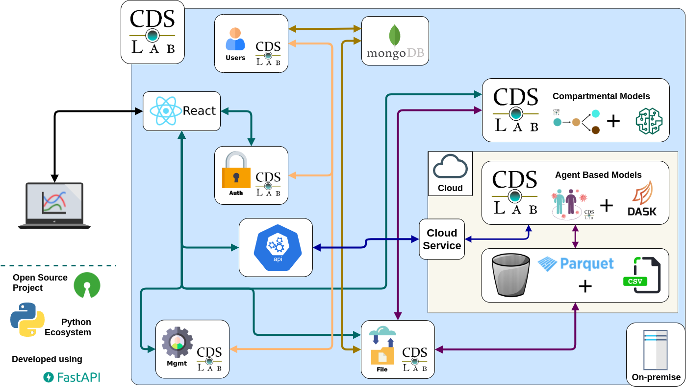

# CDSLib

Welcome to the **Contagious Disease Simulation Library (CDSLib)**.

This is an open source initiative made available to researchers, decision
makers and the general public.

This projects aims to be a workplace for addressing different epidemic
modelling frameworks, in order to tackle potential epidemics and related issues
using open source high performance computing.

We encourage oher scientist to contribute to this project, so that complex
models they produce are available not only for researching but for helping
decision makers to take decisions based in the most advanced models.

## Table of contents

- [CDSLib](#cdslib)
  - [Table of contents](#table-of-contents)
  - [Available models](#available-models)
    - [CDSLib_agents](#cdslib_agents)
    - [CDSLib_cmodels](#cdslib_cmodels)
  - [Architecture diagram](#architecture-diagram)
  - [History](#history)
    - [Why open source?](#why-open-source)
  - [Who we are](#who-we-are)
    - [Team](#team)
  - [Sponsor information](#sponsor-information)
  - [Future Work](#future-work)

## Available models

### CDSLib_agents

The [CDSLib_agents](https://github.com/fenfisdi/cdslib_agents) module
implements an agent based model describing contagion dynamic in different
scenarios, from small compartments to cities.

### CDSLib_cmodels

The [CDSLib_cmodels](https://github.com/fenfisdi/cdslib_cmodels) module
implements a dynamical deterministic model describing epidemics following
a SEIRV model.

## Architecture diagram

## History

This projects began as a voluntary initiative from some members of the
[Fundamentals and Teaching of Physics and Dynamical Systems Group (FEnFiSDi)](https://fenfisdi.weebly.com)
from **Universidad de Antioquia (UdeA)** in March 2020 to bring our technical and
theoretical skills on natural systems modelling to the emerging sanitary thread
posed by the COVID-19 pandemic. After joining forces with the
**Epidemiology Group** of UdeA and recruiting more members of our research
group, we began a new phase with funding from the
**National Ministry of Science and Technology** and the
**National Learning Service**.

### Why open source?

We believe in the transformative power science has in society.
We are committed to bring scientific knowledge to society and this is our
way to help during this challenging scenario we are facing as humanity.

## Who we are

We are the **Fundamentals and Teaching of Physics and Dynamical Systems Group**
from Universidad de Antioquia in Medellin, Colombia. Our work ranges from
research to science education. Our research has centered on gene regulatory
networks, evolution of behaviour, city dynamics, weather and information theory.
Visit our page for further information:
[Fundamentos y Enseñanza de la Física y los Sistemas Dinámicos](https://fenfisdi.weebly.com)

### Team

- Boris Rodriguez, Physics Professor, Universidad de Antioquia
  - [CvLAC](http://scienti.colciencias.gov.co:8081/cvlac/visualizador/generarCurriculoCv.do?cod_rh=0000057681), [Perfil en Google Scholar](https://scholar.google.com/citations?user=swUKsPkAAAAJ&hl=es)
- Isabel Hoyos, Physics Professor, Universidad del Quindío
  - [CvLAC](https://scienti.minciencias.gov.co/cvlac/visualizador/generarCurriculoCv.do?cod_rh=0000236594), [Perfil en Google Scholar](https://scholar.google.com/citations?user=YzeNe7EAAAAJ&hl=es)
- Paula Díaz, Public Health Professor, Universidad de Antioquia
  - [CvLAC](https://scienti.minciencias.gov.co/cvlac/visualizador/generarCurriculoCv.do?cod_rh=0000168785), [@diazpaula](https://twitter.com/diazpaula)
- Gloria Machado, Biology Professor, Universidad de Antioquia
  - [CvLAC](https://scienti.minciencias.gov.co/cvlac/visualizador/generarCurriculoCv.do?cod_rh=0000028061)
- Camilo Hincapié, Data Scientist, Physics MSc, Universidad de Antioquia
  - [CvLAC](https://scienti.minciencias.gov.co/cvlac/visualizador/generarCurriculoCv.do?cod_rh=0001494583), [Perfil en LinkedIn](https://www.linkedin.com/in/camilo-hincapie-gutierrez/)
- Lina Ruiz, Biology MSc Student
- Nicole Rivera, Physics BSc Student
- Juan Esteban Aristizábal, Physics BSc
- Mariana  Jaramillo, Physics BSc Student
- Elías De Vargas, Systems Engineer
- Luis Papiernik, Physics BSc Student
- Elkin Bonet, Public Health MSc Student
- Sebastián Espejo, Biologist, UdeA
- Shirley Cárcamo, Biologist, UdeA
- Óscar Mendoza, Public Health MSc Student
- Carolina Rojas, Astronomy BSc Student
- Juan Pablo Pérez
- Sofía Sánchez, Biology BSc Student
- Andrea Sánchez, Public Health BSc Student
- Ian Mejía, Physics BSc Student

## Sponsor information

For more information on our current sponsors visit:

- [National Ministry of Science and Technology of Colombia](https://minciencias.gov.co/)
- [National Learning Service (SENA)](https://www.sena.edu.co)

## Future Work

We pretend to extend our work beyond the COVID-19 pandemic to different
diseases currently affecting human health or epidemics yet to come.
According to the
*Intergovernmental Science-Policy Platform on Biodiversity and Ecosystem Services*,
future pandemics are expected to happen more often
[https://www.ipbes.net/pandemics-media-release](https://www.ipbes.net/pandemics-media-release).
